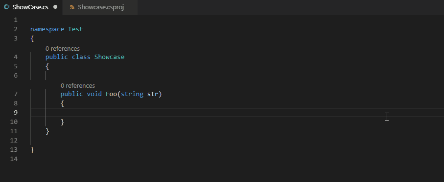
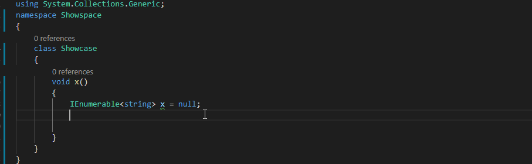
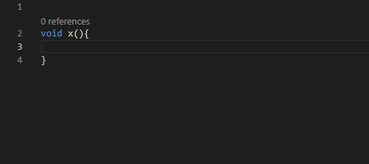
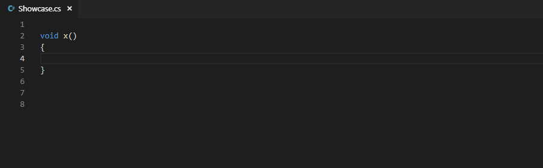

# Auto-Using for C#
Auto-imports and provides intellisense for references that were not yet imported in a C# file. 

## The new beta version of Auto-Using
- Increased the amount of references you can import from .NET base library (~3000 references) to every NuGet package you add to your project (up to **~1,000,000** references).

- Completions will now appear for libraries you have added to your project. 
- Completions should now be much faster in cases in which there are many completions.
- Fixed completions sometimes not showing working near comments.
- Fixed the extension hanging when there is no project file.
- Actually fixed completions not appearing after the "this" keyword.
- Fixed internal classes appearing in completions.
- Fixed attributes having an `attribute` suffix.

To beta test the new version of Auto-Using, download [The VSIX file for auto-using-0.7.99](https://github.com/natanfudge/Auto-Using/blob/master/auto-using-0.7.99.vsix) (0.8.0 is reserved for the release verison.)
Then in Visual Studio Code, Go to `Extensions`, then press the `...` icon at the top right corner of the extensions screen, and select  `Install from VSIX...`.
Locate the Auto-Using vsix file you have downloaded, select it and press `install`. 
If you find any bugs, please direct them to [The issue tracker](https://github.com/natanfudge/Auto-Using/issues).

       

  

         

Works for extension methods. No more being confused that linq methods don't exist.

         

  
  
Gives priority to completions that were chosen before.

         

Sometimes there are multiple completions with the same name. In that case they are compressed into a single completion and you get to choose between them.

----

## Changelog

### 0.7.4 
- Fixed extension methods not appearing for arrays.

### 0.7.3 
- Fixed extension methods not appearing after method calls with parameters, and after variables enclosed in parentheses. 
- Fixed certain extension method options sometimes not appearing 

### 0.7.2
- Fixed completions not appearing after the `in` keyword (relevant for `foreach` loops).
- Fixed extension methods not appearing for fully qualified paths. 

### 0.7.0
- Auto-Using now Auto-Imports extension methods! Using Linq has never been easier.
- Fixed completions appearing when typing space unlike the C# extensions, which causes completions to seem like they are happening for no reason.

### 0.6.12
- Fixed completions not appearing after the "this" keyword (matters for writing extension methods).

### 0.6.1
- Improved time it takes to provide completions from "essentialy nothing" to "actually nothing most of the time and almost actually nothing the rest of the time". (Thanks for the Auto-Import ext for a cool idea)

### 0.6.0
- Improved time it takes to provide completions from at least 0.4 seconds to essentialy nothing.

### 0.5.0 
- When there are two or more types with the same name, a (sorted based on your previously selected completions) quick pick menu will show up, giving you an option to choose between the different namespaces. 

### 0.4.0 
- Completions no longer appear when typing a variable name.

If completions are appearing when they shouldn't, or not appearing when they should, please make an issue. 

### 0.3.3
- Increased the amount of references you can import from mscorelib (~900 references) to entire .NET base library (~3000 references).

If there is something missing from the base classes please make an issue.

### 0.2.3 
No more of that weird prefix stuff, completions that you have never chosen will be deprioitized but not prefixed. 

### 0.2.0
Removed unnecessary files

### 0.1.0
In an attempt to prevent this extension from cluttering Intellisense:
- Import completions you have chosen before will now get an highly increased priority
- Import completions you have never chosen will be prefixed (configurable) to highly reduce their priority.

### 0.0.3
Released
